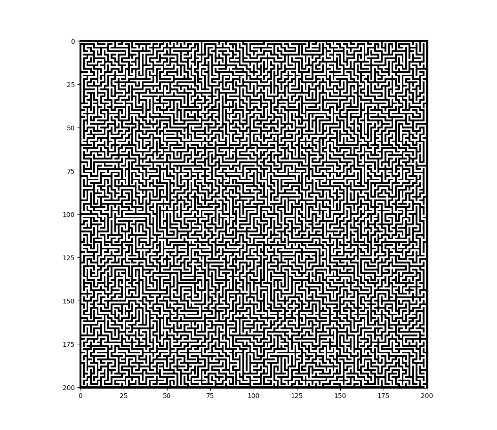

# Maze-generator

An implementation of a random, solvable, any size, maze generator using the recursive backtracking algorithm

Maze is displayed using matplotlib.pyplot so make sure to have it on your machine (in cmd type "pip install matplotlib")

    

 

